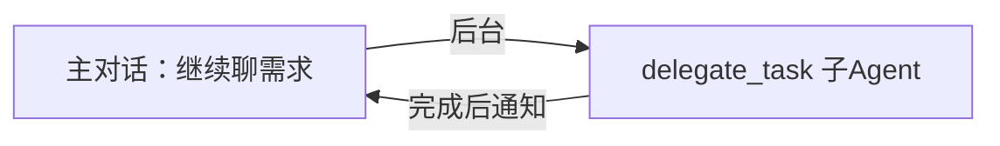

# AI工具SaaS产品化方法论

## 核心原则

### 第一反应：产品化思维

用户提出一个AI工具/Agent/自动化方案时，**不要默认想成内部工具**。第一反应应该是：
1. 这个能不能做成**产品卖掉**？
2. 哪些人需要这个？
3. 愿意付多少钱？

> 用户明确纠正过："别局限在我身上"——AI工具天然适合产品化，不要只想着给自己用。

### SaaS产品定位决策：垂直化 vs 通用化（Pivot评估框架）

当产品需要从垂直类目扩展到全类目（或反过来），用这个框架评估：

| 评估维度 | 垂直化（如：只做服装） | 通用化（全类目） | 
|:--------|:--------------------|:---------------|
| TAM/市场规模 | 小（一个类目） | 大10-100倍 |
| **护城河** | **强**（行业深度=竞品难复制） | **弱**（跟竞品正面竞争） |
| 开发难度 | 高（需专业知识库） | 低（通用LLM+RAG即可） |
| 获客精准度 | 高（一句话说清"给谁用"） | 低（"给所有人用"=没人用） |
| 客单价天花板 | 中 | 中 |
| 加价空间 | 有（垂直插件可额外收费） | 少（全是基础功能） |
| 大厂碾压风险 | 低（大厂不做这么细） | 高（大厂免费版直接打死） |

**核心判断逻辑：**

垂直改通用，最大的代价是 **丢掉差异化**。原来能说"我们比福客AI懂服装"→改通用后变成"我们跟福客AI做一样的事，但我们更便宜"——后者很难活，因为巨头能用亏损换市场。

**推荐模式：通用底座 + 垂直插件（混合策略）**

```
通用底座（基础版，¥49-99/月）
├─ 多平台接入
├─ LLM+RAG自动回复（全类目通用）
├─ 转人工+看板+按量计费
└─ 商家上传任意产品资料

↓ 客户按需选装

垂直插件（¥19-39/月/个）
├─ 服装尺码引擎 → 退货率降5-15%
├─ 面料知识库
├─ 3C参数比对
├─ 美妆成分解答
└─ 食品保质期查询
```

**优势：**
- 获客打"全类目通用"——TAM大，客户面广
- 垂直插件做转化——客户进来后看到行业专用功能，愿意升配
- 竞品做不到——大厂不做垂直深耕，垂直创业公司没有通用底座
- 你原有的行业经验还是能用上

**什么时候应该坚持垂直而不是转通用：**
1. 你的核心差异化是**行业专业知识**（数据/规则/算法）
2. 目标客户**痛点足够痛**，宁可多付费也要行业专用方案
3. 竞品已占据通用市场，但你在大厂无暇顾及的垂直缝隙里

### 垂直→通用/通用→垂直的Pivot影响结构化分析

当用户在垂直/通用之间犹豫时，用这个分栏分析帮ta看到全貌：

```
✅ 变容易的：
├─ TAM/市场规模：小了 → 大了10-100倍
├─ 开发难度：高（需要专业知识库） → 低（通用RAG即可）
├─ 获客广度：窄 → 宽
└─ 技术维护：重 → 轻

❌ 变难的：
├─ 差异化：有护城河 → 跟竞品正面刚
├─ 营销钩子：精准 → 泛泛
├─ 大厂碾压风险：低 → 高（免费版打死）
├─ 加价空间：有插件可收 → 纯基础功能
└─ 竞品定位：从"比你懂×" → "跟你一样但便宜"（后者活不了）
```

**核心逻辑：** Pivot最大的代价是丢掉差异化。如果垂直改通用后只能说"我更便宜"，那就先别改。最好方案是**通用获客 + 垂直变现**。

### 竞品分析框架

对比竞品时，突出你的**结构性优势**：

| 维度 | 大厂竞品 | 你的优势 |
|:----|:---------|:--------|
| 团队 | 200-1000人，月固定成本百万 | 1人，月固定成本¥30-200 |
| 技术栈 | 3-5年前的老架构（规则引擎） | 最新LLM+RAG |
| 定价空间 | 必须卖¥1800+才能回本 | 卖¥99也有利润 |
| 灵活度 | 改功能要排期审批 | 今天改明天上线 |

**结论：** 降维打击——用低成本结构做低价产品，大厂跟不了。

---

## 一、SaaS vs 软件销售模式决策

| 维度 | SaaS模式（推荐） | 软件销售模式 |
|:----:|:---------------|:------------|
| 部署方式 | 客户扫码授权→你用你的服务器替他回 | 你提供安装包→客户装自己电脑上 |
| AI推理费用 | ✅ 算你的（成本的一部分） | ❌ 算客户的（客户自己配API Key） |
| 服务器 | ✅ 你的服务器（¥24-100/月） | ❌ 客户自己搞 |
| 收费方式 | 按月收SaaS费 | 一次性卖软件或年费 |
| 客户门槛 | 低（扫码即用，无需技术） | 高（要自己装环境） |
| 锁定效应 | 强（数据在你这，方便续费） | 弱（客户拿了就跑） |
| 售后 | 需要监控服务器 | 几乎不用管 |

**建议：** 对中小客户，**SaaS模式是唯一选择**。零安装、扫码授权即用，转化率高一个数量级。

---

## 二、多租户隔离（防止串台）

SaaS最基础的问题：A客户的消息不能发给B客户，A的知识库不能让B看到。

### 标准架构

```
数据库（每个客户一个独立"容器"）
┌──────────────────────────┐
│  tenant_id    │ 数据      │
├──────────────────────────┤
│  customer_A   │ Token/知识库/对话记录 |
├──────────────────────────┤
│  customer_B   │ Token/知识库/对话记录 |
└──────────────────────────┘
```

### 隔离层级

| 隔离层 | 做法 | 串台概率 |
|:------|:-----|:--------:|
| 平台Token | 每个客户Token存在不同记录 | 0% |
| 知识库 | 按tenant_id分表，查询时强制过滤 | 0% |
| 对话历史 | 按tenant_id+客户ID双索引 | 0% |
| LLM上下文 | 每个请求只带对应tenant的上下文 | 0% |
| 账单 | 按tenant_id统计API用量 | 0% |

**关键：** 每行LLM请求都带 `tenant_id`，系统提示词中注入对应客户的知识库。这是SaaS最成熟的技术，几十万用户的系统都这么搞。

---

## 三、定价策略

### 三级定价模板

| 套餐 | 定价 | 适用 | 限制 |
|:----|:----:|:----|:----|
| 个人版 | ¥99/月 或 ¥999/年 | 个人小卖家 | 限1-2店铺 |
| 专业版 | ¥299/月 或 ¥2,999/年 | 中小团队 | 限5店铺 |
| 企业版 | ¥699/月 或 ¥6,999/年 | 代运营/大客户 | 不限 |

**定价逻辑：** 比请一个客服省¥5,000/月，你的产品只要¥99-699，价值感强。

### 成本测算公式

```
总成本 = API推理费 + 服务器费 + 其他
       = 客户数 × 日均消息 × 单次API费 × 30 + 服务器
```

### ⚠️ 成本测算最大陷阱：缓存命中率过于乐观

这是 AI SaaS 定价中最容易翻车的地方。不同文档给出的单次成本经常差5-10倍，原因在**缓存命中率的假设**：

| 假设条件 | 乐观估计 | 保守估计（更接近真实） |
|:--------|:---------|:-------------------|
| 缓存命中率 | 70%（技术文档常见乐观值） | **30-50%**（客服场景每次问法不同） |
| 单次输出tokens | 200 | **300-500**（含完整回复+表情+数据） |
| 单次LLM成本 | ¥0.001 | **¥0.005-0.01** |
| 毛利率 | 80-90% | **可能需要下修到28-44%** |

**真实教训：** 同一个产品，用乐观假设算出来毛利率90%，用保守假设算出来可能是 **亏损（-10%到-36%）**。

**安全做法：**
1. 先用 ¥0.01/次（保守值）算一遍，确保这个价还有利润
2. 设定 **用量封顶 + 超额按量计费**——超出部分客户付钱，你永远不会亏
3. 定价中预留 30-50% 安全边际（给API涨价留空间）
4. 不要用"全部客户都能命中缓存"的假设算成本

```
修正后的示例（保守假设）：
客户套餐 ¥99/月（含10,000次）
修正后LLM成本：10,000 × ¥0.005 = ¥50/月
其他成本分摊：¥25/月
总成本：¥75/月
毛利：¥24/月（24%毛利率，仍然健康）

但如果是高用量套餐（企业版¥699含150,000次）：
LLM成本：150,000 × ¥0.005 = ¥750/月
总成本：¥800/月
→ **亏损 ¥101/月 ⚠️**
→ 必须限制含对话次数或提高定价
```

---

## 四、平台API对接指南

### 主流电商平台对表

| 平台 | 开放平台 | 入驻门槛 | 客服消息API | 难度 |
|:----:|:--------:|:--------:|:-----------:|:----:|
| 抖店 | openjinritemai.com | 个体工商户即可 | ✅ 有 | ⭐⭐ |
| 淘宝 | open.taobao.com | 需企业认证 | ✅ 旺旺IM API | ⭐⭐⭐ |
| 拼多多 | open.pinduoduo.com | 企业资质 | ✅ 有 | ⭐⭐ |
| 抖音 | open.douyin.com | 个体/企业 | ✅ 私信API | ⭐⭐ |

**对接方式：** OAuth授权（一次扫码，token自动续期），服务器对服务器，不需要浏览器登录子帐号。

### 社交渠道

| 渠道 | 方案 | 备注 |
|:----|:----|:-----|
| 微信 | Hermes已接入 / 企微API | 个人号谨慎（封号风险） |
| 抖音私信 | 开放平台私信API | 正规接入 |
| 小红书 | ⚠️ 无开放API → 浏览器自动化兜底 | 封号风险，作为兜底 |
| 快手 | 类似小红书 | 作为兜底 |

### ⚠️ 微信个人号：iLink桥接的4小时会话过期问题

Hermes 微信端使用 iLink（ilinkai.weixin.qq.com）桥接个人微信，这是第三方方案。

**关键限制：** iLink 会话大约 **4小时** 后服务端主动过期，gateway 检测到 `SESSION_EXPIRED_ERRCODE` 后 pause 10分钟再重试，但因用的是同一个过期token，会陷入死循环。

**现象：** 微信端不发消息，gateway日志报 `[Weixin] Session expired; pausing for 10 minutes`

**Headless服务器生成二维码方法：**
```bash
pip install qrcode[pil] aiohttp
python3 -c "
import asyncio, sys
sys.path.insert(0, '/home/ubuntu/.hermes/hermes-agent')
from gateway.platforms.weixin import qr_login
result = asyncio.run(qr_login('/home/ubuntu/.hermes'))
"
```

**推荐做法：写监控脚本检测心跳，过期后在飞书/Telegram推送新二维码让用户扫。**

**代替方案：** 企业微信（免费不掉线）或 公众号（¥300/年认证费），都是官方接口。

---

## 五、MVP路线图模板

| 阶段 | 核心功能 | 建议时长 |
|:----|:---------|:--------:|
| 第1版 | 1个平台API + 知识库RAG + 自动回复 + 转人工 + 看板 | 2周 |
| 第2版 | 第2个平台 + 跨平台客户关联 + 满意度评价 | +1周 |
| 第3版 | 第3个平台 + 自动补发/退款 + 差评预警 | +2周 |
| 第4版 | 多租户完善 + 话术模板 + 开放API | 持续 |

---

## 六、销售渠道优先级

| 渠道 | 方式 | 转化率 |
|:----|:----|:------:|
| 🎬 短视频（抖音/快手） | 拍对比视频「AI 1分钟回XX条 vs 人工回X条」 | 最高 |
| 📕 小红书 | 发卖家效率工具合集、种草文 | 中 |
| 🤖 扣子模板商店 | 上架引流模板 ¥9.9-19.9 | 引流 |
| 👥 电商社群 | 进卖家群发试用链接 | 中 |
| 🤝 代运营合作 | 你提供工具，代运营推给客户 | 高（批量客户） |

---

## 七、一人公司做SaaS的特别提醒

| 风险 | 等级 | 应对 |
|:----|:----:|:----|
| 平台API变更/下线 | ⚠️ 中 | 只对接核心API，减少耦合；多平台分散风险 |
| 客户数据安全 | ⚠️ 中 | 数据只经过授权范围；用云厂商的合规方案 |
| 资质限制（如淘宝要企业认证） | ⚠️ 高 | 先做门槛低的平台验证，后加高门槛的 |
| 竞争对手降价 | ⚠️ 低 | 成本结构决定了你能比竞品低3-5倍还有利润 |
| 单人运维压力 | ⚠️ 中 | 先做标准品→跑通→再用AI自动化运维；代码写好运维脚本 |

---

## 八、常用技术选型

| 层 | 推荐 | 理由 |
|:--|:-----|:-----|
| 后端 | Python + FastAPI | 熟Python，快 |
| 前端 | Vue3 + 现成模板 | 1人公司，别从头写UI |
| 数据库 | SQLite起步→MySQL | 够用+简单 |
| 部署 | 阿里云轻量服务器 ¥24/月起 | 便宜够用 |
| LLM | DeepSeek API（¥0.001/次） | 成本最低 |
| RAG | LlamaIndex / 直接向量+Embedding | 轻量快速 |

---

## 九、方案整合工作流：多文件项目文档 → 可执行方案

当用户一次性丢来多个项目文档（zip/多文件/多份MD），用这个流程处理：

### Step 1: 全量摄入 + 交叉验证

```
1. 解压/列出所有文件 → 分类（产品/技术/营销/竞品/财务）
2. 并行读取全部文件（别一个一个读，太慢）
3. 找内部矛盾：
   ├─ 同一个数字在不同文件里打架（比如成本¥0.001 vs ¥0.005）
   ├─ 不同角色写了矛盾的建议（技术说2天能搞定，PM说要1周）
   └─ 理想假设 vs 实际约束（假设70%缓存命中 vs 实际30-50%）
4. 标记所有矛盾点 → 交给用户决策，不要自己替他选
```

### Step 2: 给出结构化概要

读完14个文件后，给用户一个"项目全貌"表格：

| 维度 | 内容 |
|------|------|
| 定位/名字 | 一句话描述 |
| 技术栈 | 后端/前端/数据库/LLM |
| 定价 | 最低-最高/毛利估算 |
| 目标客户 | 画像/规模/痛点 |
| 开发周期 | MVP/全功能时间 |
| 盈亏点 | 几个客户回本 |
| 最大竞争对手 | 谁/为什么危险 |
| **内部矛盾（红色标记）** | 文件里哪些数字打架 |

### Step 3: 等用户决策 → 整合

用户做决策（比如"全类目不要只做服装"）后：
1. 重新算财务模型（新方向下的成本/定价/毛利）
2. 重新排开发优先级（功能新增/变少/移动）
3. 输出一个 **单一可执行方案文件**，覆盖：
   - 产品架构（含改动说明）
   - 定价表+损益表
   - 技术路线（标注新增/修改了什么）
   - 营销策略调整
   - 执行路线图（天级，标注改动）
4. 存到项目目录下，注明这是"整合后版本"

### Step 4: 组织文件

- 原始文件保持不动（用户可能回头查）
- 整合方案单独存，文件名带版本标记
- 项目根目录保持清晰结构

---

## 十、非技术创始人审核代码的正确方式

当用户说"我不懂代码怎么审核"，ta不是要学写代码，是需要一个**不用看代码也能验证项目质量的方法**。

### 核心原则：审功能，不审代码

| 用户做的事 | AI做的事 |
|:----------|:---------|
| 说"这里不对" | 全部代码写完+部署好 |
| 注册一个测试账号跑流程 | 配置好环境，开好测试入口 |
| 在界面点一下，看结果对不对 | 根据反馈定位代码问题 |
| 说"看板数据不对" | 查数据库+改逻辑 |
| 说"计费算错了" | 修计费引擎 |

### 可用工具来避免"盲审"

| 场景 | 最佳做法 |
|:----|:--------|
| 是否跑通了？ | AI直接启动服务 + 返回测试curl命令，用户复制粘贴就行 |
| 功能对不对？ | AI给一个测试流程清单："第1步注册 第2步登录 第3步发消息 第4步看回复" |
| 数据对不对？ | AI给SQL查询命令，用户跑一下看结果 |
| 改了什么？ | AI给diff摘要，不用看代码本身 |

### 话术模板

```
你不审核代码，你审核功能。这是你要做的事：
1. 打开我给你的链接
2. 注册一个账号
3. 点这个按钮、看那个页面
4. 告诉我哪个地方不对

你看的是界面和效果，不是代码。跟买软件一样——你只管点，出问题告诉我，我修。
```

---

## 十一、用 delegate_task 构建大型项目的工作流

当用户要求搭建一个完整的 SaaS 项目（5000+行代码，多模块），用这个模式并行处理：

### 适用条件

- 项目有明确的技术选型（已决策）
- 功能清单已定（不需要用户再拍板）
- 代码量大（1个会话搞不定）
- 不想阻塞主对话节奏

### 工作流



### 最佳实践

1. **context 必须自包含** — 子Agent没有主对话的记忆，所有技术决策、文件路径、设计约束都要写在 context 里
2. **"不要问我"原则** — 在context末尾写"不要用clarify问我，所有设计决策已在上方定死"，避免子Agent卡住
3. **P0/P1优先级** — 标注哪些功能是MVP必须跑的，哪些可以等
4. **验证指令** — 要求子Agent完成后给出启动命令和测试curl示例
5. **约束要写死** — 技术选型前面加"（已确定，不要改）"
6. **处理好后追加** — 主对话中如果又新增需求（如智能备注），等子Agent跑完第一版再追加，不要中断

### 验证阶段：子Agent输出检查清单

子Agent完成后，**不要直接相信它说的文件结构和API路径**——它可能按自己的理解写了不同路径。

**必做检查：**
```bash
# 找实际API路由（大概率跟spec不完全一致）
grep -r "router = APIRouter\|@router\.\|\include_router" app/ --include="*.py" -n

# 确认venv和依赖
source venv/bin/activate && pip list
```

**常见偏差及处理：**
| Spec写的是 | 子Agent可能写成 | 找实际路径的方法 |
|:----------|:--------------|:----------------|
| `/api/knowledge/add` | `/api/knowledge/items` | `grep router.*prefix knowledge.py` |
| `/api/plugin/list` | `/api/plugins/available` | `grep -r "api/plugin" app/ --include="*.py"` |
| `deepseek-v4-flash` | `deepseek-chat` | 检查config.py里的model字段 |

### Pitfall: JWT测试token被脱敏

Hermes的 `security.redact_secrets` 拦截 `eyJhbG...`（JWT开头），导致 terminal 中拿到的token被脱敏。正确做法：

```python
# 写独立测试脚本，用httpx直接跑
import httpx, json
BASE = "http://localhost:8000"
client = httpx.Client()
r = client.post(f"{BASE}/api/auth/login", json={"username":"x","password":"x"})
token = r.json()["access_token"]  # 这里拿到的token是原始的
```

### Pitfall: DeepSeek API Key 不在环境变量里

即使终端里能调 Hermes，`$DEEPSEEK_API_KEY` 也可能为空——它被存放在 `~/.hermes/.env` 中，需要手动 source：

```bash
# 启动应用时带上key
export $(grep -v '^#' /home/ubuntu/.hermes/.env | xargs)
python -m app.main

# 或在 systemd service 中配置 EnvironmentFile=/home/ubuntu/.hermes/.env
```

检查方法：`cat ~/.hermes/.env | grep DEEPSEEK`

### Pitfall: 子Agent的模型名可能不对

子Agent继承的模型配置可能写错model名。检查config.py，确保 `DEEPSEEK_CHAT_MODEL` 匹配实际API可用的模型名。

### context 模板结构

```
## 项目概况
（一句话说清做什么）

## 服务器环境
（IP/OS/配置/端口）

## 技术选型（已确定，不要改）
（表格式清单）

## 需要实现的功能（按优先级）
### P0 — MVP必须跑通
### P1 — 联调需要

## 项目结构要求
（目录树）

## 关键设计决策（不要问我，按这个做）
（逐条写死）

## 验证方式
（启动命令 + curl测试）

## 约束
- 不要用clarify问我
- 不要调用delegate_task
- 回复语言用中文
```

---

## 十二、智能备注（Smart Notes）功能设计

> 参考 `references/智能备注功能设计.md` 获取完整设计文档

AI客服系统中，AI不只回复，还要识别客户需求并记录。核心逻辑：

1. 消息处理器中，AI生成回复后**再额外判断**客户是否留了备注需求
2. 如有 → 提取结构化信息（类型+内容+订单号）→ 写入 `customer_notes` 表
3. 商家看板展示 ⚠️ 待处理备注
4. AI正常回复不打断（维持3秒响应），备注是附加动作

### 与转人工的边界

| 客户行为 | 处理方式 |
|:--------|:---------|
| 说操作需求（改尺码/改地址） | AI正常回复 + 记录备注 |
| 发脾气/投诉/退款 | 记录备注 + 转人工 |
| 发图片（售后） | 记录备注 + 转人工 |
| 连续追问3次未解决 | 转人工，带上下文 |

---

## 十三、服务器部署检查清单（MVP测试版）

当用户问"这台服务器能不能跑测试版"，按这个顺序检查：

### 硬件检查

| 项 | 最低要求 | 测试版够？ |
|:--|:--------|:---------:|
| CPU | 2核 | ✅ 够（FastAPI单进程） |
| 内存 | 2G可用 | ✅ 够（SQLite，无GPU） |
| 磁盘 | 10G空余 | ✅ 一般没问题 |
| 操作系统 | Ubuntu 20.04+ | ✅ |

### 环境检查

```bash
# Python版本
python3 --version          # 需≥3.10
# 是否已有项目冲突
ps aux | grep python       # 检查已有进程
# 端口占用
ss -tlnp | grep -E ':80|:443|:8000'  # Web端口是否被占
# 防火墙
sudo ufw status            # 如有防火墙，需开80/443/8000
```

### 并发风险评估

| 已有服务 | 风险 | 处理方式 |
|:--------|:----|:--------|
| 定时脚本（量化/资讯等） | ⚠️ 并发时抢CPU | 用进程内APScheduler，不另起进程 |
| Hermes Agent | 低 | 它主要做推理调用，不吃本地算力 |
| 其他Web服务 | ⚠️ 需确认 | 端口冲突检查 |

### 部署步骤

```
1. Nginx 安装 + 反向代理配置（FastAPI跑在8000端口，Nginx暴露80）
2. 备案期间临时方案：IP+端口调试（如 http://43.138.xxx:8000）
3. 域名备案下来后：Nginx配SSL（Let's Encrypt免费）
4. 进程管理：Supervisor保活 uvicorn 进程
```

### 何时该升级服务器

| 指标 | 当前够 | 该升级了 |
|:----|:------|:--------|
| 客户数 | < 50 | ≥ 50 |
| SQLite数据库 | < 200MB | > 500MB |
| CPU长期负载 | < 70% | > 80%持续 |
| 内存使用 | < 2G | > 3G |

升级方向：从 ¥24/月 → ¥68/月（4核4G） 或 同配置再买一台做负载均衡。

---

## 十四、批量文件导入功能实现

> 参考 `references/批量文件导入模式.md` 获取完整代码模板和5种格式的解析函数

当 SaaS 产品需要让用户从本地批量导入数据（知识库条目、商品信息、FAQ、问答对），用这个模式：

1. **后端**：一个 `/upload` 端点，支持 CSV/XLSX/JSON/TXT/MD 五种格式
2. **解析引擎**：每种格式独立解析函数，共享同一套列名映射（支持中英文列名）
3. **容错**：CSV用 `utf-8-sig` 兼容Excel导出BOM头、JSON支持 `[{...}]` 或 `{items: [...]}` 包裹格式、XLSX用 `read_only=True` 防大文件OOM
4. **前端**：拖拽区 + 文件校验 + 确认导入 + 进度条 + 结果反馈

**依赖**: `openpyxl`（解析xlsx），`python-multipart`（FastAPI文件上传）

**投产路径**: 知识库上传 → 提取通用模式 → 复用到商品批量导入、FAQ导入、客户名单导入等场景

---

## 十五、SaaS 前端引导页设计：接入指引 + 渠道管理

### 问题

商家注册 SaaS 后，发现前端只有功能页面（看板/知识库/账单），但没有"我现在应该怎么做"的指引。这是 SaaS 产品常见的**冷启动空洞**——用户进来了但不知道下一步去哪。

### 标准方案：接入指引 + 渠道管理

两个页面解决冷启动问题：

| 页面 | 定位 | 内容 |
|:----|:----|:-----|
| **接入指引** (setup-guide.html) | 新手引导 | 步骤式：注册→套餐→配置店铺→Webhook→插件→使用 |
| **渠道管理** (channels.html) | 持续配置 | 添加/编辑/删除电商平台，展示回调地址，显示接入状态 |

### 接入指引页设计模式

```
标题横幅（热情欢迎+一句话定位）
↓
进度条（6步线性导航：①注册→②套餐→③店铺→④回调→⑤插件→⑥使用）
↓
步骤详情（每步一个卡片，含说明+配置指引+跳转按钮）
↓
常见问题 FAQ（折叠式，解决大部分入门疑问）
```

**关键原则：**
- 每步都有 **操作入口**（"去配置店铺 →"按钮），不让用户干看
- 已完成步骤标记为 ✅，降低焦虑
- FAQ 放在底部，不打断流程但需要时能查

### 渠道管理页设计模式

```
全局信息横幅（Webhook 回调地址，一键复制按钮）
↓
已配置平台列表（每个平台一条：图标/名称/店铺名/Key状态/启停状态/操作按钮）
↓
未配置平台网格（点击"立即配置"弹出表单）
↓
添加/编辑弹窗（平台选择/店铺名/AppKey/AppSecret 表单）
```

**关键原则：**
- 回调地址全局展示，方便复制去电商平台配置
- 已配置列表显示 **Key 末尾几位 + 是否有 Secret**，不暴露完整凭据
- 每个平台有 **接入文档链接**（直接跳转抖店/拼多多开放平台）
- **available 字段**是关键设计：后端返回当前租户尚未配置的平台列表，前端直接渲染，不硬编码

### 配套后端 API 设计

```
GET    /api/channels           → {channels: [...], available: [...], webhook_base}
POST   /api/channels           → 新增平台配置
PUT    /api/channels/{id}      → 编辑/启停
DELETE /api/channels/{id}      → 删除
```

### 导航统一

所有页面导航一致：`看板 | 接入指引 | 渠道管理 | 知识库 | 账单`
用 `bg-indigo-500`（当前页）和 `hover:bg-indigo-500`（其他页）做视觉区分。

---

## 十六、插件域扩展（Plugin Domain Expansion）

当 SaaS 产品从初始域（如服装）扩展到新域（如汽车配件），需要创建新的插件类别。

详细参考：`references/插件扩展_自动件域(AutoParts).md`

### 新插件域的步骤

1. **数据层** — 构建领域数据库（车型→尺寸映射表）
2. **匹配算法** — 处理该领域的特殊匹配需求（车型名模糊匹配、同义词、品牌-型号双字段）
3. **注册流程** — PluginEngine.register() + 定价配置 + chat路由
4. **系统提示** — 在 get_system_prompt() 中通知 LLM 新能力

### 关键注意事项

- **单字匹配守卫** — 仅限独立词+品牌前缀双重验证，避免CRV误配哪吒V
- **多实体并发** — 客户一句话可能涉及多个实体（多台车），匹配算法需支持返回数组
- **域命名规范** — `category` 字段用 `auto_parts` 这种语义名称，不要用品牌名
- **自动写打包备注** — 匹配到结果后要自动写入 `customer_notes`（类型 `wiper_pick`），让仓库人员直接看到SKU，见参考文件
- **Webhook触发模式** — 订单备注推送不需要LLM，本地JSON匹配即可，零API成本
- **品牌别名+错别字处理** — 常见品牌简称(haval→哈弗)和错别字(哈佛→哈弗)必须覆盖，否则用户搜不到
- **跨品牌过滤** — 用户说"哈弗H6"时不能返回"红旗H6"，见品牌过滤代码

### 插件定价参考

| 插件类型 | 定价区间 | 说明 |
|---------|---------|------|
| 服装尺码引擎 | ¥29/月 | 含BMI+版型算法 |
| 面料知识库 | ¥19/月 | 知识库型，轻 |
| 雨刮器车型匹配 | ¥29/月 | 数据库型，覆盖200+车型 |

---

## 十七、MCP Server 产品化路径 — 方法论的终极产品形态

### 适用场景

你有一套方法论/决策框架/分析协议，想做成可售卖的产品，但：
- 做SaaS太重（需前后端+数据库+用户系统）
- 做教程/课程太轻（容易被盗版、价值感低）
- 目标用户是开发者/Agent，不是终端消费者

**MCP Server 就是答案：把方法论打包成一个 Agent 可调用的工具。**

### 架构

```
用户 → Agent (Claude/Cursor/Hermes/Coze)
        ↓ 用户说"帮我分析这个项目"
        ↓ Agent 识别到需要决策分析能力
        ↓ 调用
你的 MCP Server（决策协议层）
        ├─ validate_project    → 红蓝分析报告
        ├─ evaluate_persona   → 六分身评估
        └─ decision_report    → 完整决策报告
        ↓
返回结构化结果
```

### 对方法论型产品为什么是最优解

| 形态 | 盗版风险 | 价值感 | 规模化难度 |
|:----|:--------:|:-----:|:---------:|
| 课程/教程 | 🔴 极高 | 低 | 低 |
| 模板/PDF | 🔴 高 | 中 | 中 |
| SaaS网站 | 🟢 低 | 中 | 高 |
| **MCP Server** | **🟢 极低（API调用不可盗版）** | **高（每次调用都交付结果）** | **低（我写你部署）** |

### 注意：谁是你的客户

| 客户 | 对你的价值 | 如何触达 |
|:----|:---------:|:--------|
| **Agent开发者** | 按调用收费 | MCP市场（阿里云/Swfte/MCPmarket） |
| **企业决策部门** | 订阅制 | 直接BD（需要销售流程） |
| **普通创业者** | ❌ 不直接买MCP | 不适合做目标客户 |

**MCP Server 是基础设施型产品，不是消费品。** 你的客户是能搭Agent的人，不是最终想创业的人。

### 售卖渠道

| 渠道 | 收费方式 | 分成 | 说明 |
|:----|:--------|:---:|:----|
| 阿里云云市场 | 按次/资源包 | 15-20% | 国内最大，推荐首发 |
| Swfte Marketplace | $0.002-0.10/次 | 平台抽成 | 海外开发者 |
| MCPmarket.cn | 云托管 | — | 国内MCP集市 |
| 自建订阅 | ¥99-299/月 | 0% | 自己卖，但需要获客 |

### 定价参考

| 工具类型 | 市场参考价 | 说明 |
|:--------|:---------:|:----|
| 数据查询类MCP | $0.001-0.004/次 | Postgres/Slack等 |
| 生成类MCP | $0.01-0.10/次 | 图片/视频生成 |
| **决策分析MCP** | **¥0.05-0.20/次** | **价值远高于数据查询类** |

一次决策分析可能帮用户省¥10,000+的试错成本，定价应是数据查询类的10-50倍。

### 技术起步

```python
# 最小MCP Server骨架（Python）
from mcp.server.fastmcp import FastMCP

mcp = FastMCP("Decision Protocol", port=8123)

@mcp.tool()
def validate_project(project_desc: str, constraints: str) -> str:
    """用红蓝分析法验证项目可行性"""
    return decision_engine.analyze(project_desc, constraints)

@mcp.tool()
def evaluate_persona(project_desc: str, persona: str) -> str:
    """从指定角色角度评估项目（产品经理/技术/营销/财务/运营/合规）"""
    return persona_engine.evaluate(project_desc, persona)

if __name__ == "__main__":
    mcp.run(transport="sse")
```

### 什么时候该做MCP而不是SaaS

| 选MCP | 选SaaS |
|:----|:------|
| 核心是方法论/决策协议 | 核心是用户数据/协作 |
| 目标用户是开发者 | 目标用户是普通用户 |
| 需要快速上架验证需求 | 愿意花几周搭建前后端 |
| 按调用收费合理 | 按月/年收费更合理 |

### 数据飞轮

每调用一次MCP Server，就产生一份真实决策案例。这些案例可以：
1. 匿名化后喂回引擎，提升分析质量
2. 脱敏后作为营销素材（「帮X用户做过决策」）
3. 反哺方法论迭代（什么类型项目最常见？什么场景最难？）

---

## 十八、本地演示/测试打包 — 零成本让朋友试用

### 场景

朋友/潜在客户想试用你的 SaaS 产品，但你没部署到公网（或不想让他们用你的API Key产生费用）。方案：**打一个zip包，他们用自己的API Key在自己电脑上跑**。

### 打包结构

```
project-package/
├── app/                    # 完整项目代码（不含__pycache__）
├── requirements.txt        # 项目依赖
├── .env.example            # API Key配置模板
├── start.bat               # Windows一键启动
├── start.sh                # Mac/Linux一键启动
└── README.md               # 使用说明
```

### 关键设计原则

| 原则 | 说明 |
|:----|:-----|
| **零费用** | 让朋友用自己的 API Key，你一分不花。推荐 DeepSeek（注册送几百万token） |
| **零命令行** | 解压 → 改.env → 双击启动，朋友不需要懂技术 |
| **自动装依赖** | 启动脚本自动建 venv + pip install，不用手动操作 |
| **自动打开浏览器** | 启动后自动跳 localhost:8000，减少问"在哪打开" |
| **自包含** | 不依赖你的服务器、域名、备案信息，断网也能用（只要Key有效） |

### 启动脚本写法

#### Windows (start.bat)

```
@echo off
chcp 65001 >nul
title 项目名称

:: 检查 Python
python --version >nul 2>&1
if %errorlevel% neq 0 (
    echo [错误] 请先安装 Python 3.9+
    pause
    exit /b
)

:: 首次运行创建 .env
if not exist .env (
    copy .env.example .env
    notepad .env    ← 自动打开编辑器让用户填Key
    pause
    exit /b
)

:: 创建 venv + 装依赖
if not exist venv (python -m venv venv)
call venv\Scripts\activate.bat
pip install -r requirements.txt -q

:: 启动服务 + 打开浏览器
start http://localhost:8000
python -m app.main
```

#### Mac/Linux (start.sh)

```bash
#!/bin/bash
# 检查 Python3
if ! command -v python3 &> /dev/null; then
    echo "[错误] 请先安装 Python 3.9+"
    exit 1
fi

# 首次运行创建 .env
if [ ! -f .env ]; then
    cp .env.example .env
    echo "请编辑 .env 填入 API Key 后重新运行"
    exit 1
fi

# 创建 venv + 装依赖
if [ ! -d "venv" ]; then python3 -m venv venv; fi
source venv/bin/activate
pip install -r requirements.txt -q

# 打开浏览器（兼容不同OS）
if command -v xdg-open &> /dev/null; then xdg-open http://localhost:8000
elif command -v open &> /dev/null; then open http://localhost:8000; fi

python -m app.main
```

### .env.example 模板

```
# 必填：填写你的 API Key
DEEPSEEK_API_KEY=sk-your-key-here

# 可选：端口号（默认8000）
PORT=8000
```

### 成功操作

朋友到手后只需 **4步**：
1. 解压 zip
2. 去 [platform.deepseek.com](https://platform.deepseek.com) 注册拿 Key
3. 编辑 `.env` 填 Key
4. 双击 `start.bat`（或 `./start.sh`）

浏览器自动打开 → 注册账号 → 开测。

### 费用透明（打消朋友顾虑）

> "调用走你自己的 DeepSeek Key，注册送几百万token，够测几个月。你一分钱不用额外花。"

### 需要排除不要打包的文件

```
排除 __pycache__/  .pyc   venv/   .git/   *.db（让用户生成全新的）
```

打包命令：
```bash
zip -r package.zip package_dir/ -x "*/__pycache__/*" "*.pyc"
```

### 适用和不适用场景

| 场景 | 适合？ |
|:----|:------|
| 朋友说要试用 | ✅ 最适合，零成本 |
| 潜在客户想深度体验 | ✅ 比公网demo更真实 |
| 不想暴露服务器IP | ✅ 完全本地运行 |
| 客户要全链路验证 | ✅ 可以自己配置开放平台 |
| 客户不会装Python | ❌ 需要用pyinstaller打包成exe |
| 客户要求Windows双击即用 | ❌ 需要打包Python运行时（体积>50MB） |

---

## 企业级 Agent 平台搭建咨询（合并自 enterprise-agent-platform）

**触发**：「公司用Agent怎么搭」「多部门几十人怎么搞」「各部门Agent功能是什么」——真实公司多部门 AI Agent 架构咨询（区别于本技能上文的产品化：那是把工具变产品卖，这是给企业设计内部平台）。

### 一问四答框架
1. **架构模式**：部门=工作区、Agent=部门内助手、知识库=部门文件（独享）、工具=API（ERP/数据库/爬虫）、机器人=飞书/企微 bot 对话入口
2. **平台选型**：Dify（综合企业平台，原生多租户+可自部署，**首推**）/ FastGPT（知识库问答为主）/ Coze（快速验证，SaaS 不可自部署）/ RAGFlow（复杂文档解析）
3. **部门 Agent 模板**：产品/运营/物流/财务/人事/市场逐部门 Agent 功能定义，见 `references/enterprise-department-agents.md`
4. **成本估算**：DeepSeek V4 ¥5/亿tokens，10人≈¥30-60/月、30人≈¥90-180/月、50人≈¥150-300/月（预算×2）；服务器 ¥100/月；简单问答走 flash、复杂推理才用强模型

**设计范式（Anthropic Managed Agents 三层解耦）**：Brain（无状态推理+控制循环）/ Session（append-only 事件日志）/ Sandbox（隔离执行环境）；**Pet 变 Cattle**（组件可独立崩溃恢复，不丢 session）；接口稳定>实现稳定；凭据不进沙箱；Brain↔Sandbox 统一 `execute(name, input) → string` 接口。完整参考 `references/managed-agents-architecture.md`。

**用户状态判断**：「了解下/暂时不用」→ 只给概念+成本不 push；「帮我搭/想试试」→ 转执行模式；「给预算方案」→ 细化到具体人数+部门。

## Coze（扣子）模板上架变现（合并自 coze-template-authoring）

**触发**：「做个扣子模板」「上架扣子商店卖模板」。渠道优先级：扣子模板商店（自然流量最大）→ 抖音/B站演示视频（带购买链接）→ 小红书教程 → 私域。分成：创作者拿 70-80%，平台抽 20-30%。

**方向与定价**：C端小模板 ¥9.9-39.9 走量（短视频爆款文案/小红书知识卡片/书单视频/直播话术/商品主图）；B端企业模板 ¥99-299（智能客服/销售陪练/数据分析）；**¥19.9 是黄金价格带**（超 ¥49.9 转化率断崖，促销后 ¥9.9 还有赚）。

**设计流程**：需求定位 → 模板文档（人设提示词+工作流配置+插件列表+定价+上架 checklist，完整到可直接复制粘贴）→ 工作流节点（开始/LLM/插件/代码/条件/循环/结束；**DeepSeek-R1 是扣子上性价比首选**；变量引用 `{{变量名}}`）→ 定价测算（冲量¥9.9→稳定¥19.9→成熟¥29.9-39.9）→ **配套本地 Python 工具**（先本地跑通验证逻辑，再搬上扣子；双版本方案：扣子版上架卖 + 本地版自用，本地工具必须支持配置文件持久化）。

**铁律与坑**：扣子是 React SPA 无公开 API，**不爬模板排行**（用交叉验证法推断热门方向）；工作流最少节点原则+输入校验+LLM 节点兜底输出；上架前全链路测试（空值/边界/插件/输出格式/多轮记忆）；模板商店会促销，定价留余量；用户偏好带货向优先+本地工具 alias（2-3字母短命令）。

**实战案例**：`references/coze-viral-copywriter-template.md`（爆款文案带货特工：人设+双工作流+插件列表+定价完整设计）、`references/coze-viral-copywriter-local-tool.md`（配套本地工具模板：两种模式+配置持久化）。

